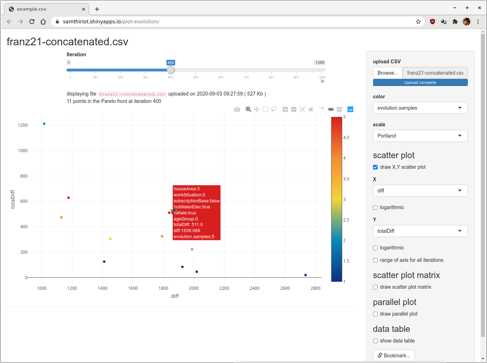
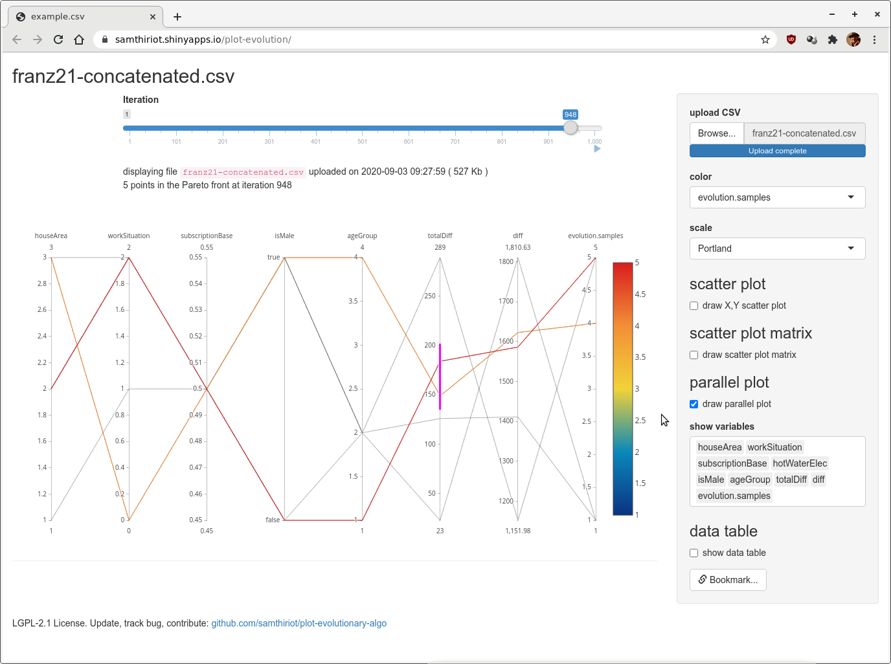
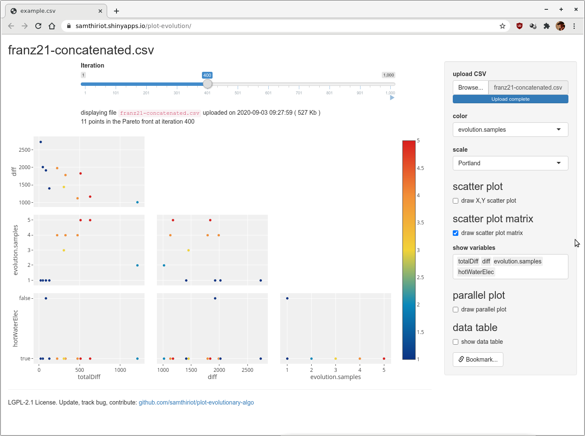

# plot-evolutionary-algo


## What is it?


This small application takes the results of an [evolutionary algorithm](https://en.wikipedia.org/wiki/Evolutionary_algorithm) and plots its output with a Plotly interactive visualization.
It intends to help a user of such an algorithm to understand what happens during the evolution and to deal with the many dimensions.
It is also supposed to be very simple at first glance, yet to also enable more sophisticated plots with a bit of parameter tuning.

This small app is standing on the shoulders of giants: [Plotly](https://plotly.com/) to build interactive diagrams, [R](https://www.r-project.org/) for data processing, [Shiny](https://shiny.rstudio.com/) to display the interactive graphs from R as web pages. 

It inherits the qualities of these components. It is notably agnostic to the platform and operating system (Windows, Linux, MacOS, or anything running R).


## Features 

Basic features: 
* a slider to explore the results of the evolutionary algorithm over iterations. 
   * Changing the slider affects all the plots on the page so they only display the results of the evolutionary algorithm in its current state.
   * a "run" button allows for the visualization of the evolution over time
* by default, a X,Y [scatter plot](https://en.wikipedia.org/wiki/Scatter_plot) using the two last columns of the dataset; on this plot, every point represents an individual tested by the evolutionary algorithm. 
(likely the two last goals explored by the evolutionary algorithm).
   * the tooltip of the points on scatter plots display info on the values of the current individual on all the dimensions, in order to make it easier to understand the relationship between variables
   * the graph can be zoomed in, panned, exported into PNG
   * the range of axis is automatically adapted according to all the iterations in order to compare easily the various generations



Advanced features: 
* Color the points of all the diagrams to add a dimension on them. The same color will be used on all the plots.
* a Scatter Plot Matrices (SPLOM) displaying all the combinations of variables (inputs, outputs)
* a Parallel Plot Diagrams to better understand the links between the various variables in the dataset






# Quickstart

First copy the CSV file with the data to graph in the current directory.

Open R:
```R
install.packages(c("plotly","shiny","DT"))
library(shiny)
runApp("https://github.com/samthiriot/plot-evolutionary-algo/releases/latest/download/shiny-app.zip")
```

# How to use it?


## Input Data

The input data format is a simple [CSV](https://fr.wikipedia.org/wiki/Comma-separated_values) file.
At start, the application will list the files having extension `.csv` available both inside the current directory 
and inside the directory of the application, then will automatically select the most recent file.
As shown in the file [launch.R](./launch.R), you also can force the file to use with an option.
The filename and date are displayed for verification in the app. 

The first column is expected to contain the current generation or iteration. 
The next columns contain the inputs and outputs. 
Data is parsed by the app using the R function `read.csv`. 

Here is an example of syntax
```
"evolution.generation","x","y","f1","f2"
3,0.8827487316661,0.100853587592227,0.8827487316661,1.2470746749355
4,0.8827487316661,0.100853587592227,0.8827487316661,1.2470746749355
5,0.8827487316661,0.100853587592227,0.8827487316661,1.2470746749355
5,0.803362888326028,2.70625615504028,0.803362888326028,4.61342714344576
6,0.8827487316661,0.100853587592227,0.8827487316661,1.2470746749355
6,0.803362888326028,2.70625615504028,0.803362888326028,4.61342714344576
7,0.8827487316661,0.100853587592227,0.8827487316661,1.2470746749355
7,0.803362888326028,2.70625615504028,0.803362888326028,4.61342714344576
8,0.8827487316661,0.100853587592227,0.8827487316661,1.2470746749355
8,0.803362888326028,2.70625615504028,0.803362888326028,4.61342714344576
9,0.8827487316661,0.100853587592227,0.8827487316661,1.2470746749355
9,0.803362888326028,2.70625615504028,0.803362888326028,4.61342714344576
10,0.8827487316661,0.100853587592227,0.8827487316661,1.2470746749355
10,0.803362888326028,2.70625615504028,0.803362888326028,4.61342714344576
11,0.803362888326028,2.70625615504028,0.803362888326028,4.61342714344576
11,0.882748731666099,0.100853580833774,0.882748731666099,1.24707466727935
12,0.803362888326028,2.70625615504028,0.803362888326028,4.61342714344576
12,0.882748731666099,0.100853580833774,0.882748731666099,1.24707466727935
12,0.882748788142001,0.100853587592227,0.882748788142001,1.24707459515101
13,0.803362888326028,2.70625615504028,0.803362888326028,4.61342714344576
13,0.882748731666099,0.100853580833774,0.882748731666099,1.24707466727935
13,0.882748788142001,0.100853587592227,0.882748788142001,1.24707459515101
14,0.803362888326028,2.70625615504028,0.803362888326028,4.61342714344576
14,0.882748788142001,0.100853587592227,0.882748788142001,1.24707459515101
14,0.882748584712965,0.100853694296586,0.882748584712965,1.24707500341622
15,0.803362888326028,2.70625615504028,0.803362888326028,4.61342714344576
15,0.882748584712965,0.100853694296586,0.882748584712965,1.24707500341622
16,0.803362888326028,2.70625615504028,0.803362888326028,4.61342714344576
16,0.882748584712965,0.100853694296586,0.882748584712965,1.24707500341622
16,0.803362864669373,2.70625615504028,0.803362864669373,4.61342727929751
17,0.803362888326028,2.70625615504028,0.803362888326028,4.61342714344576
17,0.882748731666099,0.100853580833774,0.882748731666099,1.24707466727935
17,0.803362864669373,2.70625615504028,0.803362864669373,4.61342727929751
18,0.882748731666099,0.100853580833774,0.882748731666099,1.24707466727935
18,0.803362864669373,2.70625615504028,0.803362864669373,4.61342727929751
18,0.803362888326028,2.7062551867406,0.803362888326028,4.61342593813781
```

## Install R dependancies

A few R packages are necessary for this mini app, namely `plotly`, `DT` and `shiny`. 
You can install them in several ways (see [the official doc](https://cran.r-project.org/doc/manuals/r-release/R-admin.html#Installing-packages)). 

Directly in R:
```R
install.packages(c("plotly","shiny","DT"))
```

If you are using a GNU/Linux distribution, use your package manager.
For instance for Debian/Ubuntu/Mint:
```
sudo apt install r-cran-plotly r-cran-DT r-cran-shiny
```


## Start it quickly

This is a Shiny application so it can be used as any other Shiny app.

The simplest way to test it is: *first copy the CSV file you want to plot in the current directory*. 
Then in R:
```R
library(shiny)
runApp("https://github.com/samthiriot/plot-evolutionary-algo/releases/latest/download/shiny-app.zip")
```
This should open your default web browser on an HTML page computed locally. 

you might precise the file to load:
```R
library(shiny)
options(plot.evolution.file=file_path_as_absolute("myfile.csv"))
runApp("https://github.com/samthiriot/plot-evolutionary-algo/releases/latest/download/shiny-app.zip")
```

For more details on launch, see our script [launch.R](./launch.R)


## Integration with OpenMOLE

[OpenMOLE](https://github.com/openmole/openmole) is a scientific computing soft 
dedicated to the exploration of the dynamics of simulations.
Among other features, OpenMOLE offers [calibration features](https://next.openmole.org/Calibration.html) based 
on [genetic algorithms](https://next.openmole.org/Genetic+Algorithms.html).

A genetic algorithm in OpenMOLE generates one CSV file per generation.
In order to visualize such a result, the best is to first merge the resulting CSV files,
then to download the results and open them with this app. 

We show in the [openmole](./openmole) directory examples of how to make this.

# Advanced usage

## Start the application so it is available from other computers

For the application ran by Shiny to be accessed from other computers, you first have to ask Shiny to "bind" not only the local IP address which is only available from the computer running the script, but all the network interfaces. 
You might also specify the port the application will listen to. 

```R
library(plotly)
options(shiny.host = "0.0.0.0", shiny.port = 55555)
runApp("plot-evolution")
```

